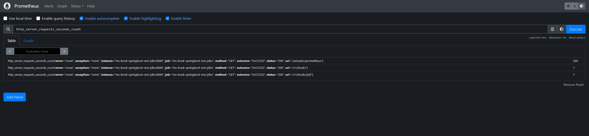

# Book API :: Micronaut and Jdbc

## Overview

Microservice responsible to manager books providing endpoints to get a list of books and retrieve a book by Id. 

## Entity Relationship Diagram (DER)


> :information_source: Project to create the book database [book-database](../book-database)

## API ###

### Get Book by Id
| Endpoint           | Method | Description                              |
|--------------------|:------:|------------------------------------------|
| /v1/books/{id}     |  GET   | Return detail of specified book          |

### Example
> GET /v1/books/1 

#### Response
````json lines
{
  "id": 1,
  "title": "The World's First Love: Mary  Mother of God",
  "isbn": "8987059752",
  "languageId": 2,
  "numPages": 276,
  "publicationDate": "1996-09-01",
  "publisherId": 1010
}
````

### Get list Books 
| Endpoint          | Method | Description          |
|-------------------|:------:|----------------------|
| /v1/books         |  GET   | Return list of books |

### Example
> GET /v1/books

#### Response
````json lines
[
  {
    "id": 1,
    "title": "The World's First Love: Mary  Mother of God",
    "isbn": "8987059752",
    "languageId": 2,
    "numPages": 276,
    "publicationDate": "1996-09-01",
    "publisherId": 1010
  },
  {
    "id": 2,
    "title": "The Illuminati",
    "isbn": "20049130001",
    "languageId": 1,
    "numPages": 352,
    "publicationDate": "2004-10-04",
    "publisherId": 1967
  },
  {
    "id": 3,
    "title": "The Servant Leader",
    "isbn": "23755004321",
    "languageId": 1,
    "numPages": 128,
    "publicationDate": "2003-03-11",
    "publisherId": 1967
  }
]
````

## Postman collection


## Build & Run

### Local

```bash
mvn clean install
```
Execute o comando abaixo para rodar a aplicação.
```bash
java -jar ms-book-micronaut-rest-jdbc.jar
```

### Docker

to build
```
docker build -f Dockerfile -t ms-book-micronaut-rest-jdbc:1.0.0 .
```

to run as a container
```
docker run -d -p 8080:8080  -i -t ms-book-micronaut-rest-jdbc:1.0.0
```
### Docker Compose

build and run containers
```
docker-compose up --build
```

stop containers
```
docker-compose stop
```

In docker-compose.yml file:

- Books Service : **__8080__** port is mapped to **__8080__** port of host
- MySQL : **__3306__** port is mapped to **__3306__** port of host
- Prometheus : **__9090__** port is mapped to **__9090__** port of host
- Grafana : **__3000__** port is mapped to **__3000__** port of host


### Port

8080

## Grafana


| Attribute |         Value         | 
|-----------|:---------------------:|
| URL       | http://localhost:3000 |
| Username  |         admin         |
| Password  |         admin         |
| Port      |         3000          |


## Prometheus

| Attribute |         Value         | 
|-----------|:---------------------:|
| URL       | http://localhost:9090 |
| Port      |         9090          |




## VERSIONS

### 1.0.0

- Micronaut 3.9.2
- Micronaut Data Jdbc
- Java 17
- Prometheus
- Grafana
- MySQL 8